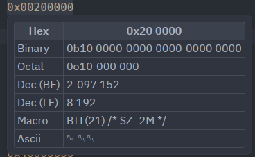
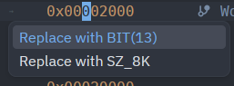
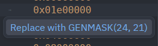

# Zed BitPeek

Zed BitPeek is a [Zed](https://zed.dev) extension that shows alternate representations of integer literals on hover. It is a renamed fork of [A-23187/zed-hexpeek](https://github.com/A-23187/zed-hexpeek), keeping the original literal conversion behavior while adding C and Linux-kernel-oriented helpers.

## Credits And Status

BitPeek is based on HexPeek by [A-23187](https://github.com/A-23187). The rename is intentional to avoid confusion with the original project and marketplace extension; this repository is a derivative, not the upstream project.

Credit for the original Zed extension, language-server integration, and baseline hover conversions go to the original author. This fork were vibecoded to accomodate my workflow. No support is provided in this repository.

## What Changed From Upstream

- Adds macro-aware hovers for `BIT(n)`, `GENMASK(high, low)`, and `SZ_<n>K` values.
- Shows suggested macro equivalents, including `SZ_*` aliases where applicable, for positive powers of two and contiguous bit masks.
- Adds code actions that rewrite eligible hex literals to `BIT(n)`, `SZ_*`, or `GENMASK(high, low)`.
- Accepts common C integer suffixes such as `u`, `ul`, `lu`, `ull`, and `llu`.
- Reworks hover output from a code block into a compact markdown table with the hovered representation promoted to the header.
- Bundles and launches the checked-out language server from `language_server/dist/server.cjs` instead of installing the npm package at runtime.

## Screenshots







## Setup

Enable the BitPeek language server for the languages where you want numeric hovers:

```json
{
  "languages": {
    "C++": {
      "language_servers": ["bitpeek-language-server"]
    }
  }
}
```

Zed language server extensions must declare supported languages up front. If your language is not listed in `extension.toml`, add it to the `languages` array for `bitpeek-language-server`.

## Development

The extension launches the bundled language server artifact:

```sh
cd language_server
npm install
npm run build
```

Commit both `language_server/src/server.js` and the rebuilt `language_server/dist/server.cjs` when changing language-server behavior.

## License

Apache-2.0
